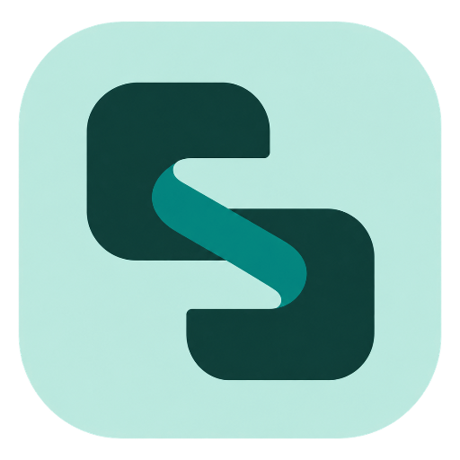
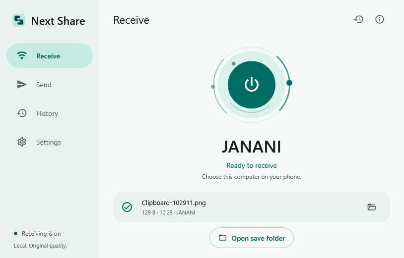
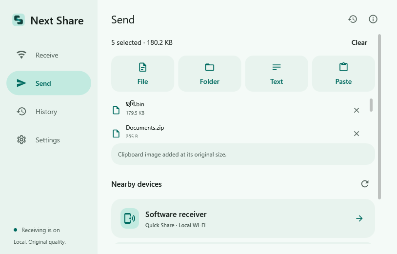
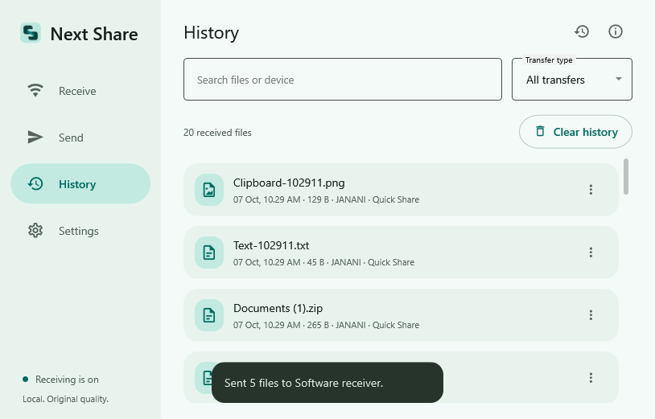
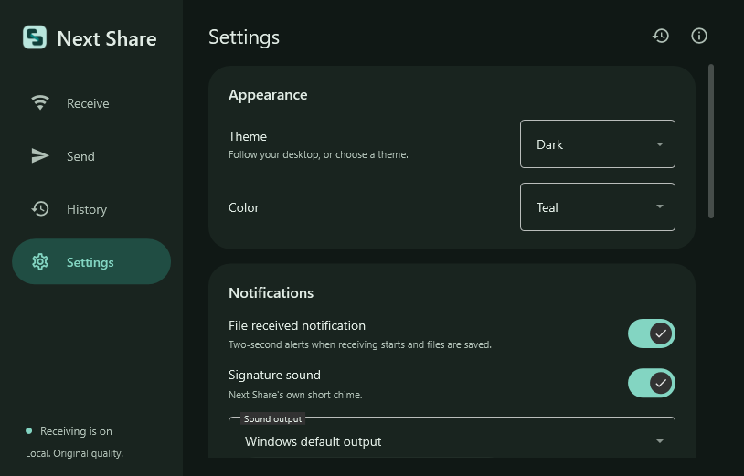

<div align="center">



<h1>Next Share</h1>

<p><strong>Photos and documents, straight to your Windows PC.</strong></p>
<p>A compact Material 3 desktop app for local file sharing, built around a simple receive-first workflow.</p>

<a href="https://github.com/Tanvir00ff00/Next-shere/releases/latest"></a>


<p>
<a href="https://github.com/Tanvir00ff00/Next-shere/releases/latest"><strong>Download for Windows</strong></a>
&nbsp; · &nbsp;
<a href="#preview">Preview</a>
&nbsp; · &nbsp;
<a href="#get-started">Get started</a>
&nbsp; · &nbsp;
<a href="#build-from-source">Build from source</a>
</p>

</div>

---

## Made for everyday file sharing

Next Share was created for local computer shops that receive photos and documents from different customers throughout the day. It brings receiving, sending, transfer history and preferences into one small Windows app.

| Feature | What you get |
| --- | --- |
| **One receiving switch** | A single power button controls Bluetooth and the independent Quick Share receiver. Receiving starts enabled. |
| **Files saved where you choose** | Received files go directly into your selected folder. Duplicate names get a numbered suffix. |
| **Flexible sending** | Select files, folders, text or clipboard content, or drag files into the window. Folders are sent as ZIP snapshots. |
| **Visible progress** | Follow each incoming transfer with its device name, received bytes and progress. |
| **Two moments of feedback** | A small arrival card appears when receiving begins, followed by a completion card after files are saved. |
| **A signature sound** | An original stereo chime, with an output selector and preview in Settings. |
| **Useful history** | Search transfers, filter by transport, copy paths and open files in their save folder. |
| **Your preferred look** | System, Light and Dark themes with Teal, Blue or Violet accents. The layout adapts to smaller windows. |
| **Ready after sign-in** | Automatic login startup, receiving enabled by default and a styled system tray menu. |

Next Share saves the file bytes delivered by the sender without resizing photos or applying image compression. Clearing history keeps the saved files.

## Preview

<table>
  <tr>
    <td width="50%" align="center"><strong>Receive</strong><br><br></td>
    <td width="50%" align="center"><strong>Send</strong><br><br></td>
  </tr>
  <tr>
    <td align="center"><strong>History</strong><br><br></td>
    <td align="center"><strong>Dark theme</strong><br><br></td>
  </tr>
</table>

These previews come from isolated application smoke tests. The nearby software receiver is a test device.

## Get started

1. Download `NextShare-Setup-0.4.7.exe` from the [latest release](https://github.com/Tanvir00ff00/Next-shere/releases/latest).
2. Run the installer, approve the Windows administrator prompt and select **Install**.
3. Open **Next Share** from the desktop or Start menu. Receiving is already on.
4. In **Settings**, choose your save folder, theme and notification preferences.
5. On your phone, select a file and choose the PC through a supported sharing method.

The installer includes the .NET runtime, native protocol engine and Windows Offline Guard service. Daily app startup runs as a normal user. Before upgrading or uninstalling, use **Next Share tray menu → Exit**. Received files, history and preferences are preserved when uninstalling.

**Sending from the PC:** open **Send**, add your selection, enable receiving on the target device, select **Refresh**, choose its device card and complete any pairing or transfer prompts. Dropping files only adds them to your selection; it does not send them immediately.

**Device name:** the app defaults to the Windows computer name. A custom name in Settings changes the Quick Share identity; classic Bluetooth continues to use the Windows Bluetooth name. The **Next Share** card in Settings also shows the version of the running app.

## Sharing support

| Method | Current status |
| --- | --- |
| **Bluetooth receive** | Implemented through RFCOMM/OBEX Object Push; JPEG receiving has been validated on an Android phone. |
| **Bluetooth send** | Implemented. The recipient must support OBEX Object Push; Windows pairing may be required. |
| **Quick Share** | Independent receiver and sender using BLE discovery, encrypted Nearby connections and local Wi-Fi paths. Google's Windows app is not required. Latest BLE fixes still need physical Google and Samsung phone validation. |
| **AirDrop / iPhone Bluetooth file receiving** | Not supported in this build. |
| **QR / browser-link sharing** | Not implemented yet. |

The interface takes inspiration from LocalSend; LocalSend protocol compatibility is not implemented.

### Local transfer requirements

Phone mobile data is not required for local transfer. Quick Share can use a shared local network or a compatible Wi-Fi Direct upgrade, depending on the phone and Windows hardware. BLE peripheral support, Wi-Fi permissions and local firewall rules matter. The PC-hosted network does not enable Internet Sharing or NAT, and existing Internet Sharing is rejected.

Quick Share support is still being qualified across devices. The Windows sender does not implement L2CAP-only Bluetooth transport; those phones need a compatible local Wi-Fi route. A failed Wi-Fi upgrade for files larger than 1 MB produces an error instead of reporting success. Physical radio concurrency and transfer speeds are not established by software tests.

<details>
<summary><strong>Connection and sound tips</strong></summary>

- If Google's Windows Quick Share app is using the same radio, exit it completely from its tray menu before testing Next Share.
- For a LAN transfer, both devices must be on the same local network. Internet access is not required for the file transfer.
- A Bluetooth device appearing in the list does not guarantee that it is online or supports file receiving; Windows may include known or paired devices.
- If the chime is silent, open **Settings → Notifications**, choose the correct sound output, refresh the output list and use **Preview notification**.
- Run the app as a normal user when dragging files from Explorer. Administrator-mode windows can block drag-and-drop from Explorer.

</details>

## Build from source

Use a Windows x64 development environment with:

- .NET SDK 8 and Windows SDK targeting support.
- Rust stable for MSVC and Visual Studio C++ build tools.
- Protobuf `protoc`, with `PROTOC` pointing to the executable.
- Python 3 and NSIS for the complete installer build.

### Clone and prepare

```powershell
git clone https://github.com/Tanvir00ff00/Next-shere.git
cd Next-shere

# Download dependencies pinned by Cargo.lock.
.\tools\Prepare-NativeDependencies.ps1

# Set this to your own protoc installation.
$env:PROTOC = 'C:\Tools\protoc\bin\protoc.exe'
```

The preparation script creates local `.tools/native-vendor` and `.cargo/config.toml` files. Generated dependencies and build outputs stay out of Git. The release source ZIP already includes the native dependency sources and configuration; it can skip the download step for offline native rebuilding. The Rust toolchain and `protoc` must already be installed.

### Build and test

Run the commands sequentially:

```powershell
cargo build --release --offline --locked --manifest-path src/NextShare.QuickShare.Native/Cargo.toml

dotnet run --project tests/NextShare.Tests -c Release -- --report artifacts/core-tests.json
dotnet run --project tests/NextShare.Windows.Tests -c Release

# Build the complete self-contained app, service and animated installer.
.\tools\Build-Installer.ps1
```

The installer is written to `artifacts/NextShare-Setup-0.4.7.exe`. The build script checks the service schema, signature sound, installer status handling, application tests and packaged UI/protocol smoke checks. Building does not install the service, firewall rules or startup entry.

The protocol core is already patched. Do not rerun the historical patch scripts. For a Debug app build, build the native Debug backend first.

### Verification

The published 0.4.7 release was checked with:

| Check | Result |
| --- | --- |
| Core tests from a clean clone | **60 passed** |
| Windows Offline Guard tests from a clean clone | **7 passed** |
| Offline native dependency resolution | **180 packages resolved** |
| Encrypted loopback transfers | **4 concurrent senders, 8 files; hashes and flat destinations verified** |
| Packaged application checks | **Receive, Send, history, themes, resize, notifications and startup passed** |
| Release files | **Uploaded SHA-256 checksums verified** |

These are software and packaging checks, not a claim of compatibility with every phone. Real-device Google/Samsung Quick Share verification remains pending for the latest BLE delivery changes.

## Project map

| Directory | Purpose |
| --- | --- |
| `src/NextShare.App` | WPF interface, Windows sharing adapters and notifications. |
| `src/NextShare.Core` | File storage, OBEX, BLE framing and transfer logic. |
| `src/NextShare.QuickShare.Native` | Rust Quick Share protocol host. |
| `src/NextShare.Windows` / `src/NextShare.OfflineGuard` | Local service identity and read-only Internet Sharing checks. |
| `src/NextShare.Installer` / `installer` | Animated installer interface and Windows setup engine. |
| `tests` / `tools` | Verification, build tools and diagnostics. |
| `third_party/open-quickshare/core_lib` | Modified upstream protocol core with its original license. |

## Documentation and credits

- [Receiver architecture](docs/ADR-002-own-quick-share.md)
- [Sending architecture](docs/ADR-003-file-sending.md)
- [UI design](docs/ui-design.md)
- [Verification history](docs/verification.md)
- [Third-party notices and source provenance](THIRD-PARTY-NOTICES.md)

The Quick Share protocol backend derives from **open-quickshare** and uses **GPL-3.0-only** code. The release source bundle contains the modified backend and locked native dependency sources. MaterialDesignInXamlToolkit, .NET, NAudio and other dependencies retain their own licenses and credits. See [THIRD-PARTY-NOTICES.md](THIRD-PARTY-NOTICES.md) and the [upstream GPL license](third_party/open-quickshare/LICENSE).

Next Share is an independent project and is not an official Google product.
