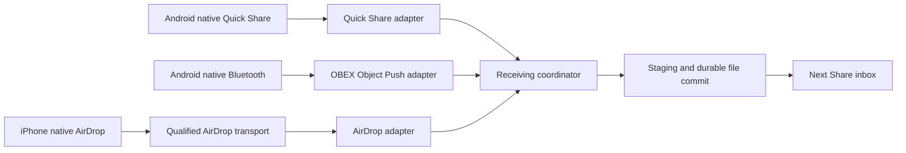

# ADR-001: One Next Share inbox with separate native transport adapters

**Status:** UI/core and Bluetooth receiver implemented; AirDrop transport selection pending; phone qualification pending
**Date:** 2026-10-05 (Asia/Dhaka)
**Deciders:** Shop owner and implementation review

## Context

Customers bring varied Android and iPhone devices to a computer/printing shop. Existing offline Wi-Fi/captive-portal experiments failed because some phones rejected or avoided the no-internet network and others did not open the portal. These are observed user reports, not independently reproduced tests.

The requested experience is a running Next Share application, one recognizable shop name, native discovery from Quick Share/AirDrop/Bluetooth, and an integrated receiving inbox. Customer internet access must remain disabled. QR/local-browser transfer is deferred. Customer app installation must not become a hidden prerequisite for native receiving.

The workspace was empty before this analysis. No old Next Share implementation was found here. The installed Google Quick Share application is already running, so a competing discovery service must not be started blindly.

## Verified local evidence

Read-only host inspection found Windows 11 Pro x64, a Realtek 8811CU USB Wi-Fi NIC, a TP-Link Bluetooth USB adapter, .NET SDK 8.0.425, and Google Quick Share 1.0.2697.0. Ethernet is present but was disconnected. Paired customer identities are intentionally excluded from saved reports.

Windows WLAN capability reporting says Wi-Fi Direct device/GO/client are supported; network monitor mode and P2P GO on 5 GHz are not supported. One concurrent channel is reported. These describe this Windows driver, not a tested Linux driver or successful Quick Share connection.

The compiled and executed diagnostic reports Bluetooth Classic, BLE, central and peripheral roles supported, but extended advertising unsupported, with a maximum advertisement length of 31 bytes. The radio is On. Google documents discovery limitations on certain networks without BLE Extended Advertising; this is a plausible contributor to previous Quick Share failures, not a reproduced diagnosis. These capabilities do not prove successful publishing or file receiving.

The shop router is an Archer C6, as supplied by the user. Hardware version, firmware, guest-network isolation and router configuration have not been inspected. No router changes were made.

## Protocol feasibility

| Entry route | Evidence | Initial implementation boundary |
|---|---|---|
| Android Quick Share | Official Windows receiver exists. Windows requirements include Bluetooth, Wi-Fi/Ethernet and specific BLE considerations. | First prove native offline receiving on real phones. External-app import cannot be described as an embedded receiver. |
| Android Bluetooth file share | Windows exposes RFCOMM/Object Push service APIs. | Implement an actual OBEX Object Push receiver and SDP advertisement, then test against stock phone Share > Bluetooth. A socket alone is insufficient. |
| iPhone AirDrop | AirDrop-compatible open implementations exist, but radio/link-layer support remains separate from application protocol logic. | No direct Windows/iPhone support is claimed on this PC. Choose and qualify an AirDrop-capable transport first. |
| iPhone ordinary Bluetooth file share | Apple's published supported-profile list does not include ordinary OBEX Object Push. | Do not offer Bluetooth file sharing as the general iPhone route. |

Quick Share is not Microsoft's Windows Nearby Sharing. Implementing the latter does not satisfy Android's stock Quick Share menu. Similarly, Google's Nearby Connections library is a connectivity foundation, not proof of complete Quick Share receiver interoperability. RQuickShare and NearDrop document LAN restrictions, which would reintroduce this shop's Wi-Fi onboarding problem.

Bluetooth Object Push remains a Bluetooth data path. Next Share cannot force an unmodified sender to switch its transfer to Wi-Fi. It is the compatibility fallback, not the large-file speed path. A QR code identifies or bootstraps a connection; it does not by itself increase throughput.

## Decision

Use a Windows desktop UI and a receiving coordinator with independent adapters. The initial implementation uses .NET 8 WPF, a real RFCOMM/OBEX receiver, durable local metadata, and a Google Quick Share companion. AirDrop and QR are unimplemented. Phone-to-PC interoperability and throughput remain unqualified.

The operator requested a compact 380 x 480 window, one power control, pulse animation, default ON, and one save-folder setting. Power ON authorizes incoming Bluetooth files; the bounded receiver saves them without opening or executing them. The shared power control starts/stops supported receivers but does not create missing AirDrop support. A small readiness note reports that boundary. Google owns its native approval and completion events; completed-folder import remains explicit. The four-connection Bluetooth admission limit bounds resource use; physical radio concurrency remains to be tested.

One inbox is feasible without one common wireless protocol. One visible application may manage multiple worker processes. A configured shop name is supplied wherever the underlying protocol permits it. Bluetooth naming may involve the Windows/radio identity; do not rename the PC automatically. Same text across protocols is not a shared cryptographic identity or a promise that every OS renders the label identically.

Only one owner advertises each protocol identity. Running official Quick Share and a custom Quick Share advertiser under the same name may create duplicate targets. A bridge visible as Next Share is still a bridge device, not a native Windows AirDrop endpoint; the UI and documentation must state that boundary.

## AirDrop options considered

| Option | Complexity | Cost | Operational scalability | Familiarity | Consequence |
|---|---|---|---|---|---|
| Windows alone with current adapters | Very high/unsupported boundary | No new hardware | Cannot qualify full iPhone route yet | .NET familiar; AWDL unproven | Do not promise all three transports. |
| Same PC plus dedicated compatible USB radio and Linux/WSL transport | High, experimental | Radio and driver/setup work | Repeatability requires a pinned qualified hardware/kernel combination | Linux radio integration unverified | Preserves one PC, but needs a research gate before product use. |
| Shop-owned supported Android receiver, forwarding locally over USB | Medium to high | Suitable phone plus bridge development | Availability depends on device/software support and foreground receiver behavior | Android forwarding not yet implemented | Potential official Quick Share/AirDrop front end; old customer phones need no custom app. |
| Shop-owned Mac AirDrop receiver, forwarding over local network | Medium | Additional Apple hardware | OS visibility, approvals and forwarding must be qualified | Mac helper not yet implemented | Uses Apple's native receiving path; still an extra endpoint and second transfer hop. |

### Same-PC radio experiment

WinDrop is a recent MIT-licensed experimental implementation. Its current report separates successful iPhone receiving on Linux from Windows-only operation. Its tested radio had severe throughput limitations and its complete AWDL bridge path was not yet verified. Thus protocol unit tests are not evidence of fast production AirDrop on this PC. A dedicated radio with a suitable Linux driver would require physical discovery, transfer and soak tests. Plain WSL installation without raw radio access is insufficient. The business PC's existing Wi-Fi connection must not be commandeered for this experiment.

### Supported Android receiver candidate

Google currently documents receiving from iPhone on Pixel 9 or later, excluding Pixel 9a, under specified visibility conditions. This is a candidate for a shop-owned receiver, not a purchase recommendation. Borrow and test a concrete supported device first. Confirm the installed software's offline interoperability, target name, visibility duration, acceptance interaction and forwarding access.

The helper must obtain legitimate access to completed received files, forward them over a local USB channel, and retain them until the PC commits and acknowledges them. Stock Quick Share's approval and progress UI cannot be assumed to be exposed to a custom helper. Neither silent acceptance nor a single Windows-only consent window is claimed. Do not use Google's internet-backed cross-platform QR path.

## Adapter contract and truthfulness

Each adapter reports capabilities explicitly: discovery, receive, consent ownership, byte progress, cancellation, resume and sender-provided integrity metadata. Health states: Unsupported, NeedsSetup, Stopped, Starting, Advertising, Receiving, Degraded and Faulted. Only an active, healthy receiver can report Advertising; seeing hardware or starting a process is insufficient.

Events include OfferReceived, ConsentRequired, TransferStarted, BytesReceived, NativeReceiveCompleted, LocalImportStarted, FileCommitted and TransferFailed. An official-app folder import has only the events that can actually be observed; it cannot invent transfer progress or pretend to own native consent. If a capability is unavailable, the UI explains that limitation.

## Stability algorithm

1. Probe prerequisites and acquire one transport-ownership lease. Surface missing/off adapters before receiving begins.
2. Open an operator-controlled receive session. Bind offers to unique IDs and separate customer batches. Sender display names are labels, not trusted identities.
3. Validate offers and available storage; accept or reject within that protocol's deadline. Admission limits must reject busy requests clearly instead of leaving senders waiting indefinitely.
4. Stream into a unique staging file with bounded memory and backpressure. Validate filenames, sizes and archive boundaries; preserve source data. No implicit image recompression or automatic execution.
5. Count received bytes and compute a local hash. Compare to a sender digest only when the protocol provides one. A receiver-only hash cannot prove equality with the source; physical acceptance tests compare known source files separately.
6. Flush and commit completed files within the destination volume; durably record metadata. Report Ready only after the PC file is committed. A bridge's native receive success precedes PC import success and must be shown as separate stages.
7. Keep partial/incomplete data out of the printable inbox. After restart, reconcile staged/committed files and metadata; do not infer completion from an unchanged file size alone.
8. Restart failed workers with bounded backoff; distinguish an idle receiver from a stuck one. Recovery must not erase pairing, rename hardware or silently replace the selected route.

Resume is transport-dependent. Existing AirDrop/Quick Share/Bluetooth senders cannot be made to resume at an arbitrary custom chunk boundary. Native retries are respected; bridge forwarding and later QR transfer can implement their own acknowledged resume protocol.

## Consequences

The UI/core can evolve independently of radio/protocol experiments. Failure in one transport need not crash the inbox. Native consent, OS visibility and device capabilities remain external constraints. All three transports cannot be declared ready until their end-to-end tests pass. Additional hardware and OS-level transport setup are unresolved decisions, not background implementation details.

Archer C6 cannot supply a missing Windows AirDrop link layer. QR/local-browser transfer remains phase two; large files need a qualified fast data path regardless of discovery method.

## Validation gates and action items

1. [x] Inspect local OS, network interfaces, installed Quick Share and development SDK without changing settings.
2. [x] Compile/run the read-only Bluetooth capability diagnostic and retain its result in bluetooth-capabilities.json (exit code 0; capabilities read successfully).
3. [ ] Select the AirDrop transport boundary with the owner before hardware/driver work.
4. [ ] Prove stock Android Quick Share -> receiver with customer mobile data off and no internet access on its Wi-Fi path; document whether manual network join was needed. Test Google and Samsung implementations separately.
5. [ ] Prove stock Android Bluetooth -> OBEX receiver, including first-time pairing, repeat transfer, decline, timeout and radio re-enable.
6. [ ] Prove stock iPhone AirDrop -> selected transport -> committed Windows file, with customer internet unavailable. Test an older and a current iPhone.
7. [ ] On each qualified device, run 30 receive/discovery cycles, 20-photo batches, PDF transfers and filenames containing Bengali. Record discovery latency, approval count, completion rate and source/PC hashes.
8. [ ] For fast paths, test at least a 1 GB file plus a larger supported file. Record actual end-to-end speed and memory use; no throughput promise before measurement. Bluetooth is assessed separately as the slow fallback.
9. [ ] Exercise concurrent offers, same filenames, interrupted transfers, disk-full, sleep/wake, worker crash and restart. Ensure no partial file appears ready and no customer batches merge accidentally.
10. [ ] Demonstrate one visible shop name per protocol with no duplicate receiver target. Document any native companion consent window still required.
11. [x] Build the compact shop UI. Core tests (29/29), real Windows Bluetooth advertising and app OFF/ON smoke checks retained. No transport has been promoted to phone-qualified stable status.
12. [ ] Add QR/local-browser transfer after the native receiver gates pass.

Desired discovery target for supported devices is <=5 seconds at the 95th percentile in the shop test environment; this is an acceptance target, not a measured result. Universal support for every old phone is not claimed. The compatibility matrix must list exact tested devices and versions.

## Sources checked on 2026-10-05

- [Google: Quick Share for Windows requirements](https://support.google.com/android/answer/13801258?hl=en)
- [Google: Android Quick Share and current AirDrop interoperability](https://support.google.com/googleplay/answer/9286773?hl=en)
- [Google Nearby source and support status](https://github.com/google/nearby)
- [Microsoft: Bluetooth RFCOMM and Object Push service examples](https://learn.microsoft.com/en-us/windows/uwp/devices-sensors/send-or-receive-files-with-rfcomm)
- [Microsoft: Bluetooth adapter capabilities](https://learn.microsoft.com/en-us/uwp/api/windows.devices.bluetooth.bluetoothadapter?view=winrt-26100)
- [Apple: Supported Bluetooth profiles](https://support.apple.com/en-us/102842)
- [OpenDrop: Platform requirements and experimental status](https://github.com/seemoo-lab/opendrop)
- [OWL: Raw-radio requirements and limitations](https://github.com/seemoo-lab/owl)
- [WinDrop: Current measured status](https://github.com/UvejsGj/WinDrop)
- [WinDrop: Radio/bridge research setup](https://github.com/UvejsGj/WinDrop/blob/main/docs/bridge-hardware-setup.md)
- [RQuickShare: LAN restriction](https://github.com/Martichou/rquickshare)
- [NearDrop: Protocol documentation](https://github.com/grishka/NearDrop/blob/master/PROTOCOL.md)

Source claims are upstream documentation/reports. They have not been reproduced on this shop PC. Google cross-platform support is device/version-dependent and must be rechecked when selecting a receiver.

